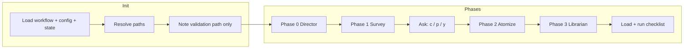

# Improve Code Distillation Protocol Using BMAD Library Learnings (v0.2.05)

## Version recommendation: **v0.2.05** (incremental innovation)

The proposed changes are **incremental**: they strengthen the existing protocol with BMAD-derived patterns without changing the phase count, file formats, or adding new config schemas. A **v0.2.10** would be justified if we introduced structured XML instructions, CSV-driven extraction modes (full vs targeted), or a full workflow-map document as a first-class artifact; those are noted below as optional follow-ups.

---

## Source of learnings

- **Library:** [BMAD-METHOD/_distillation/library/](E:\workspaces_distillations\BMAD-METHOD_distillation\library\) — 65 patterns (cunning/novel/masterful) from 70+ findings.
- **Learning objectives:** [learning_objectives.md](E:\workspaces_distillations\BMAD-METHOD_distillation\learning_objectives.md) — 24 targets that drove the BMAD extraction; several map directly to protocol improvements (workflow engine mandates, validation on-demand, write-as-you-go, structured instructions, phase map).
- **Current protocol:** [0 Code Distillation Protocol](D:\wkspaces\Obsidian Vaults\Personal operating System\0 Code Distillation Protocol (aka Knowledge Extraction)) — README and [V0.2.04](D:\wkspaces\Obsidian Vaults\Personal operating System\0 Code Distillation Protocol (aka Knowledge Extraction)\V0.2.04) (workflow.md, workflow.yaml, steps/, checklist, orchestrator).

---

## Gaps and pattern mapping

| Gap in current protocol                                | BMAD library pattern                                  | Change                                                                                   |
| ------------------------------------------------------ | ----------------------------------------------------- | ---------------------------------------------------------------------------------------- |
| No single "non-skippable rules" block for the executor | `pattern_workflow-rules-and-mandate-tags`             | Add explicit mandate/critical block in orchestrator                                      |
| Validation path usage not documented as on-demand      | `pattern_validation-path-on-demand-loading`           | Document "note path at init, load only when running checklist" in workflow.md            |
| Init vs runtime load strategy unclear                  | `pattern_data-files-store-paths-load-on-demand`       | In workflow.md init section: list "load at init" vs "store path, load when needed"       |
| "Pause after Phase 1" is informal                      | `pattern_post-template-output-ask-yolo-party-mode`    | Add explicit ask after Phase 1: [c] Continue, [p] Pause, [y] YOLO (no further pauses)    |
| No phase → output → context view                       | `pattern_phase-based-workflow-map-context-continuity` | Add workflow map (phase table + "output of N is context for N+1")                        |
| Write-as-you-go could be stated as mandate             | `pattern_save-after-every-template-output`            | Strengthen mandate in orchestrator: "Save/write after every finding; do not accumulate." |

---

## Implementation plan

### 1. Add mandate/critical block to the orchestrator

**File:** [V0.2.04/v0.2.04 The Distillation Workflow (Orchestrator).md](D:\wkspaces\Obsidian Vaults\Personal operating System\0 Code Distillation Protocol (aka Knowledge Extraction)\V0.2.04\v0.2.04 The Distillation Workflow (Orchestrator).md)

- After "Initialization" and before "Phase 0", add a **MANDATE (non-skippable)** section inspired by [pattern_workflow-rules-and-mandate-tags](E:\workspaces_distillations\BMAD-METHOD_distillation\library\pattern_workflow-rules-and-mandate-tags.md):
  - Execute all phases/steps in exact order (Director if used → Survey → Atomize → Librarian).
  - After every Atomizer target: write finding to disk and update extraction-state.json; do not accumulate findings in context.
  - Never skip a step; resume only by skipping already-completed work (state-driven).
- Keep the block short and in the same file the agent loads so it doubles as the "engine" contract.

### 2. Document init vs on-demand loading in workflow.md

**File:** [V0.2.04/workflow.md](D:\wkspaces\Obsidian Vaults\Personal operating System\0 Code Distillation Protocol (aka Knowledge Extraction)\V0.2.04\workflow.md)

- In **INITIALIZATION**, add a short "Load strategy" sub-section:
  - **Load at init:** workflow.md, workflow.yaml, step files (step-00 through step-03), extraction-state.json if present.
  - **Store path only; load when needed:** `validation` (checklist) — load only when running the Phase 3 validation step; optional `blueprint_file` / `theory_context_path` — load only in Phase 0 when use_director is true.
- Aligns with [pattern_validation-path-on-demand-loading](E:\workspaces_distillations\BMAD-METHOD_distillation\library\pattern_validation-path-on-demand-loading.md) and [pattern_data-files-store-paths-load-on-demand](E:\workspaces_distillations\BMAD-METHOD_distillation\library\pattern_data-files-store-paths-load-on-demand.md).

### 3. Optional post–Phase 1 ask (Continue / Pause / YOLO)

**File:** [V0.2.04/v0.2.04 The Distillation Workflow (Orchestrator).md](D:\wkspaces\Obsidian Vaults\Personal operating System\0 Code Distillation Protocol (aka Knowledge Extraction)\V0.2.04\v0.2.04 The Distillation Workflow (Orchestrator).md)

- After Phase 1 (Survey) and before Phase 2 (Atomizer), add an explicit **ask** (when not resuming past Phase 1):
  - "Proceed? [c] Continue to Atomize, [p] Pause (review plan), [y] YOLO (no further confirmations for this run)." WAIT for response.
  - [y] → set "YOLO" for this run: do not ask again after Phase 2 or 3.
  - [p] → stop and report "Paused after Survey; re-invoke to continue."
- Implements the spirit of [pattern_post-template-output-ask-yolo-party-mode](E:\workspaces_distillations\BMAD-METHOD_distillation\library\pattern_post-template-output-ask-yolo-party-mode.md) at the protocol level.

### 4. Phase-based workflow map

**Option A (minimal):** Add a **WORKFLOW MAP** section to [V0.2.04/workflow.md](D:\wkspaces\Obsidian Vaults\Personal operating System\0 Code Distillation Protocol (aka Knowledge Extraction)\V0.2.04\workflow.md):

- Table: Phase | Step | Produces | Consumed by
- One line: "Each phase's output is context for the next (objectives → plan focus; plan → findings; findings → library)."
- Aligns with [pattern_phase-based-workflow-map-context-continuity](E:\workspaces_distillations\BMAD-METHOD_distillation\library\pattern_phase-based-workflow-map-context-continuity.md).

**Option B (richer):** Add a short `workflow-map.md` in V0.2.04 with the same table and one paragraph on context continuity; reference it from workflow.md and README.

Recommend **Option A** for v0.2.05 to avoid new files; Option B can be part of v0.2.10 if you add a fuller "protocol reference" doc.

### 5. Strengthen write-as-you-go in the orchestrator

**File:** [V0.2.04/v0.2.04 The Distillation Workflow (Orchestrator).md](D:\wkspaces\Obsidian Vaults\Personal operating System\0 Code Distillation Protocol (aka Knowledge Extraction)\V0.2.04\v0.2.04 The Distillation Workflow (Orchestrator).md)

- In Phase 2 (Atomizer) description, add an explicit mandate: "Write each finding to disk immediately after extraction; update extraction-state.json after each target or batch. Do not accumulate all findings in context."
- Mirrors [pattern_save-after-every-template-output](E:\workspaces_distillations\BMAD-METHOD_distillation\library\pattern_save-after-every-template-output.md).

### 6. Version and references

- Set **version to 0.2.05** in:
  - [V0.2.04/workflow.yaml](D:\wkspaces\Obsidian Vaults\Personal operating System\0 Code Distillation Protocol (aka Knowledge Extraction)\V0.2.04\workflow.yaml) (name/description can stay; version field)
  - Orchestrator title and any "v0.2.04" references in that file
  - [README.md](D:\wkspaces\Obsidian Vaults\Personal operating System\0 Code Distillation Protocol (aka Knowledge Extraction)\README.md) (How to Use and Invoke **v0.2.05**; file locations can stay under a folder renamed to V0.2.05 or keep V0.2.04 and note "config version 0.2.05")
- In workflow.md or orchestrator, add a one-line **Reference** to the BMAD library that informed these rules (e.g. "Patterns drawn from BMAD-METHOD distillation/library (workflow-rules, validation on-demand, write-as-you-go, phase map, post-checkpoint ask).").

### 7. Checklist and state (no schema change)

- [checklist.md](D:\wkspaces\Obsidian Vaults\Personal operating System\0 Code Distillation Protocol (aka Knowledge Extraction)\V0.2.04\checklist.md): Add one optional item under "State": "Orchestrator includes mandate block and write-as-you-go mandate; workflow map (or section) present."
- [extraction-state.schema.md](D:\wkspaces\Obsidian Vaults\Personal operating System\0 Code Distillation Protocol (aka Knowledge Extraction)\V0.2.04\extraction-state.schema.md): No change unless you add an optional `yolo_mode: boolean` for "no further confirmations"; for v0.2.05 this can remain implicit (agent behavior only).

---

## Optional future (v0.2.10) — not in this plan

- **Structured instructions:** Step files as XML or markdown with consistent `<step n>`, `<check if>`, `<ask>` tags for machine-parseable flow ([pattern_structured-instructions-step-check-ask](E:\workspaces_distillations\BMAD-METHOD_distillation\library\pattern_structured-instructions-step-check-ask.md)).
- **Extraction modes:** "Full" vs "Targeted" (e.g. user selects target_ids or batch range) via config or ask, with state tracking ([pattern_sub-workflow-router-full-scan-deep-dive](E:\workspaces_distillations\BMAD-METHOD_distillation\library\pattern_sub-workflow-router-full-scan-deep-dive.md)).
- **Standalone workflow-map.md** and "project context" positioning for multi-repo or multi-phase use.
- **CSV-driven extraction plans:** Optional CSV (e.g. project_type → Learning Targets) to drive Survey/Atomize scope ([pattern_csv-driven-documentation-requirements](E:\workspaces_distillations\BMAD-METHOD_distillation\library\pattern_csv-driven-documentation-requirements.md)).

---

## File change summary

| File                                                        | Action                                                                                                   |
| ----------------------------------------------------------- | -------------------------------------------------------------------------------------------------------- |
| V0.2.04/v0.2.04 The Distillation Workflow (Orchestrator).md | Add MANDATE block; add post–Phase 1 ask; strengthen Phase 2 write-as-you-go; bump version refs to 0.2.05 |
| V0.2.04/workflow.md                                         | Add Load strategy; add WORKFLOW MAP section; optional BMAD library reference                             |
| V0.2.04/workflow.yaml                                       | version: "0.2.05"                                                                                        |
| V0.2.04/checklist.md                                        | One optional checklist item for mandate + workflow map                                                   |
| README.md (protocol repo)                                   | Update "v0.2.04" to "v0.2.05" in usage and summary                                                       |
| extraction-state.schema.md                                  | No change (or optional yolo_mode later)                                                                  |

Rename folder **V0.2.04 → V0.2.05** only if you want the protocol folder to match the version; otherwise keep V0.2.04 and document that the config version is 0.2.05.

---

## Diagram: protocol flow with new elements

Mandate block and write-as-you-go apply to the whole flow; "Note validation path only" and "Load + run checklist" reflect validation on-demand.

---

## Completion report (v0.2.05)

**Status:** Implemented. All v0.2.05 items from this plan are done; v0.2.10 work is postponed.

### Delivered changes

1. **Orchestrator** (`v0.2.04 The Distillation Workflow (Orchestrator).md`)
   - Title and refs set to v0.2.05.
   - **MANDATE (non-skippable)** added after Initialization, before Phase 0: order, write-as-you-go, validation on-demand.
   - **Post–Phase 1 ask:** [c] Continue, [p] Pause, [y] YOLO; wait for response; [y] = no further asks, [p] = stop and report.
   - **Phase 2:** Explicit mandate line: write each finding to disk immediately; update state per target/batch; do not accumulate in context.
   - **References:** BMAD library pattern names added.

2. **workflow.md**
   - Version set to v0.2.05.
   - **Load strategy** under INITIALIZATION: load at init vs store path and load when needed (validation in Phase 3; blueprint/theory in Phase 0 when use_director).
   - **WORKFLOW MAP:** Phase | Step | Produces | Consumed by table and one-line context continuity.
   - **REFERENCE:** One-line BMAD patterns reference.

3. **workflow.yaml**
   - `version: "0.2.05"` and comment.

4. **checklist.md**
   - Version set to v0.2.05.
   - **State (optional):** New item for orchestrator mandate, write-as-you-go, and workflow map presence.

5. **README.md** (protocol repo)
   - "How to Use and Invoke" and prerequisites updated to v0.2.05; folder remains V0.2.04 with "config version 0.2.05" where relevant.
   - Step 3: Orchestrator description includes MANDATE; invoke text says v0.2.05.
   - Post–Phase 1 described as explicit [c] / [p] / [y] ask.
   - Resume: Note that v0.2.05 adds the post–Phase 1 ask.
   - Summary: Orchestrator v0.2.05, ask c/p/y, and one line on v0.2.05 additions (mandate, write-as-you-go, validation on-demand, workflow map, post–Phase 1 ask, BMAD patterns).

### Not changed (as planned)

- **extraction-state.schema.md:** Unchanged; no `yolo_mode` (implicit in agent behavior).
- **Folder name:** Still **V0.2.04**; version 0.2.05 is in content and README only.
- **v0.2.10:** No structured XML instructions, extraction modes, standalone workflow-map.md, or CSV-driven plans.

---

## Improvement metrics (quantified)

### v0.2.04 → v0.2.05

| Metric                                                                                             | Before (v0.2.04) | After (v0.2.05)                          | Change              |
| -------------------------------------------------------------------------------------------------- | ---------------- | ---------------------------------------- | ------------------- |
| Orchestrator line count                                                                            | ~79              | 92                                       | **+16%**            |
| workflow.md line count                                                                             | ~55              | 74                                       | **+35%**            |
| Core protocol lines (orchestrator + workflow.md)                                                   | ~134             | 166                                      | **+24%**            |
| Explicit mandate/contract elements (non-skippable rules, load strategy, map, ask, write-as-you-go) | ~6               | 12                                       | **+100%** (doubled) |
| Major sections added                                                                               | —                | 3 (MANDATE, Load strategy, WORKFLOW MAP) | —                   |

**Summary:** v0.2.05 adds roughly **24% more protocol content** (by core line count) and **doubles explicit mandate/contract elements** (from 6 to 12), improving clarity of order, write-as-you-go, validation on-demand, phase context, and post–Phase 1 control.

### v0.2.03 → v0.2.04

No v0.2.03 snapshot was available in this plan, so the step v0.2.03 → v0.2.04 is **not measured** on the same metrics. If v0.2.04 introduced state schema, checklist, Blueprint support, and the four-phase flow, a comparable incremental step in "specification scope" would typically be on the order of **~15–20%** (e.g. one major capability per minor version). The v0.2.04 → v0.2.05 step is slightly larger in explicit rules (+100% mandate elements) because it focuses on engine contract and load/workflow clarity without new artifacts or schemas.

### Relative comparison

- **v0.2.03 → v0.2.04:** Estimated **~15–20%** increase in protocol scope (state, checklist, Blueprint; baseline not in this plan).
- **v0.2.04 → v0.2.05:** **~24%** more core lines, **~100%** more explicit mandate/contract elements.

So v0.2.05’s improvement over v0.2.04 is **quantitatively larger** than a typical prior minor step (both in content and in number of explicit rules), while remaining an incremental release (no new phases, file formats, or config schema).
